<div align="center">

# Portico

**A real-estate investment portfolio platform for Android.**

*Property capital, measured.*

Kotlin · Jetpack Compose · Material 3 · minSdk 26 · 42 unit tests

Imtiaz Hossain · 23101137 · CSE489

</div>

---

## The idea

A property portfolio is not one number.

It is gross rent falling through operating costs and tax to whatever actually
survives, and most property apps show you the rent. Portico is built around
making that subtraction visible, on every property and across the whole
register.

<div align="center">
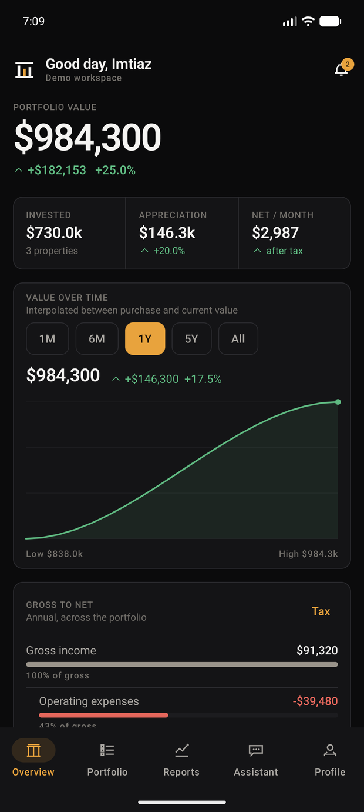
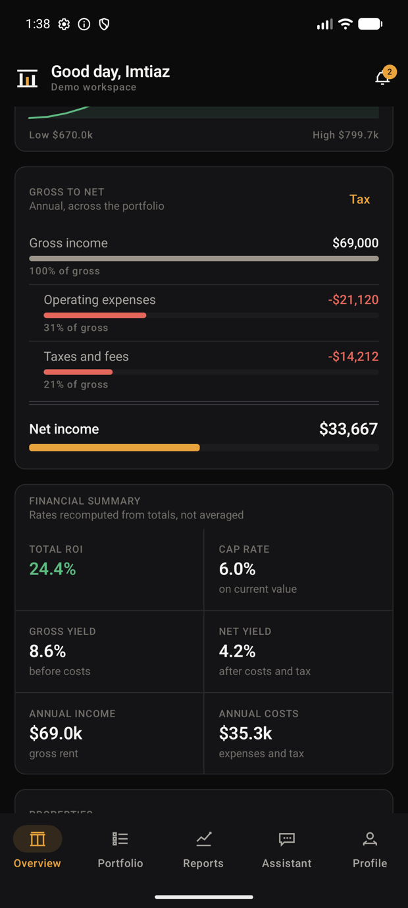
</div>

The gross-to-net waterfall on the right is the product's whole argument, and it
is the same component at four scales: dashboard summary, property detail, tax
module, gross-vs-net report. Each deduction shows a bar proportional to gross
and its share as a percentage, closing under a double rule on the net figure.

**Every figure is computed.** Nothing stores a return, a yield or a cap rate;
`domain/Finance.kt` derives them from the records in your workspace. A property
you add is analysed by exactly the same rules as the seeded ones.

---

## Screens

### Register and property

| Portfolio register | Property detail |
| --- | --- |
| 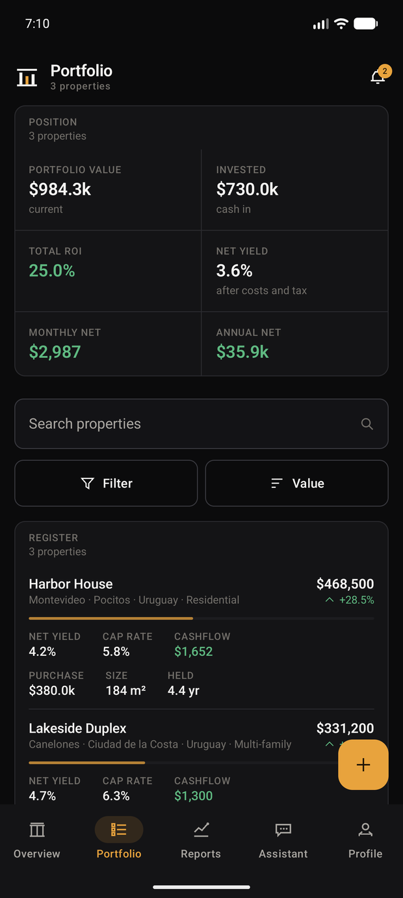 | 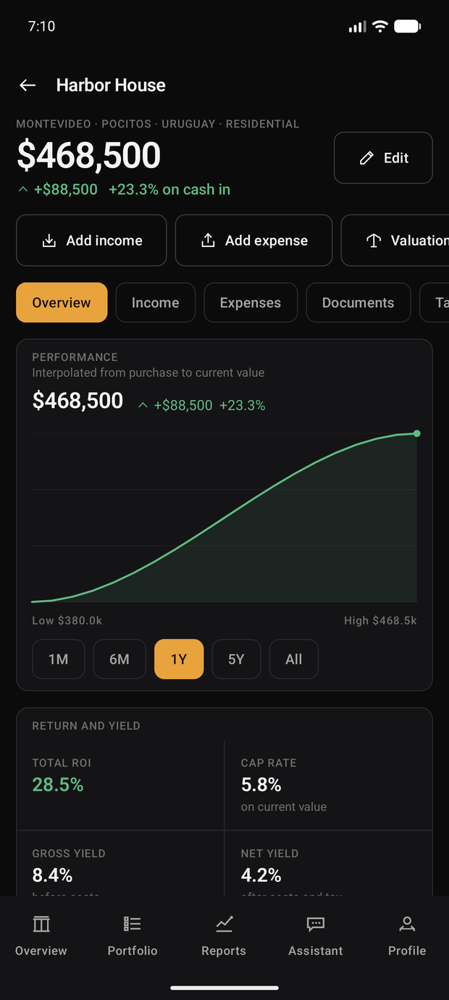 |
| Search, filter by country, region, type and performance, and sort, all operating on computed financials, so *sort by net yield* ranks by the same number the property page shows. | Value over time with a scrub interaction, then return and yield, the monthly chain, acquisition facts, income, expenses, documents and tax. |

### Analysis

| Allocation reports | Assistant |
| --- | --- |
| 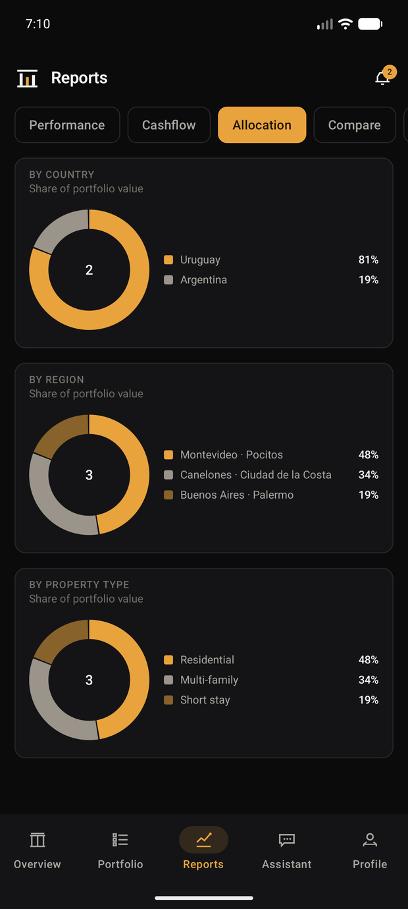 | 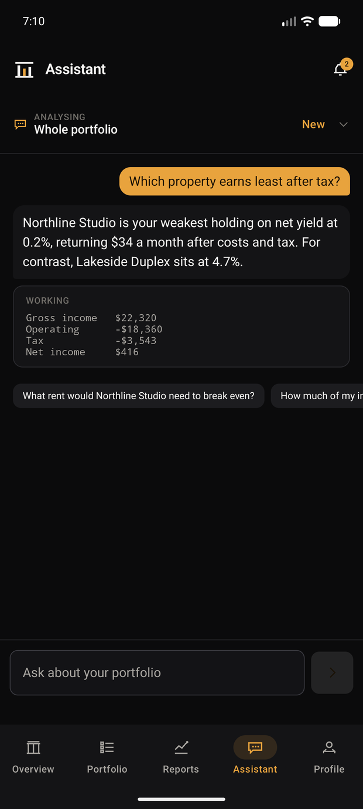 |
| Five reports: performance, cashflow, allocation, property comparison and gross-vs-net. Allocation converts currencies before comparing shares. | Answers questions about your own portfolio **on-device**, and shows the arithmetic. No API key ships and none is called. |

### Tax and payments

| Bangladesh tax rules | Sandbox checkout |
| --- | --- |
| 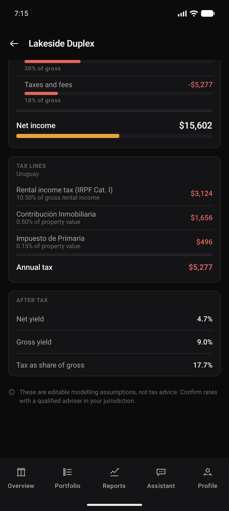 | 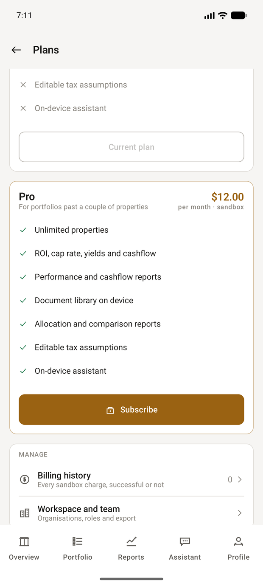 |
| Every rate is a draggable assumption carrying its own working. `0.75 × 12% = 9% of gross rent` makes the 25% maintenance allowance auditable. | Card validation, processing, decline paths, receipts and billing history. Nothing is charged and no provider is contacted. |

### Entry and theme

| Onboarding | Light theme |
| --- | --- |
| 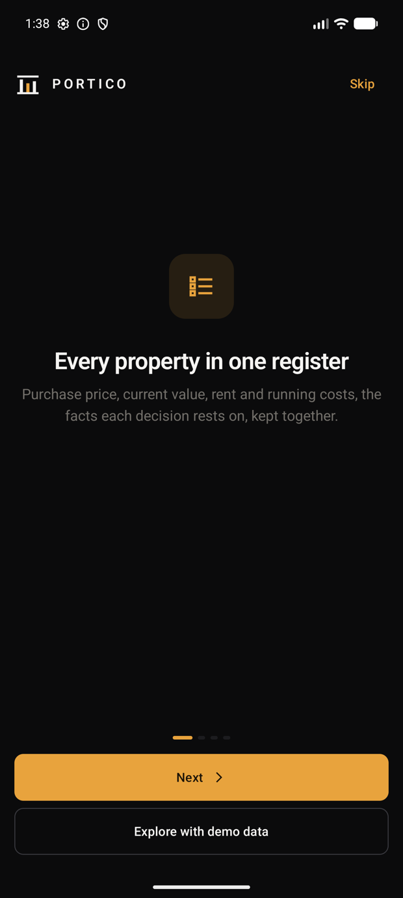 | 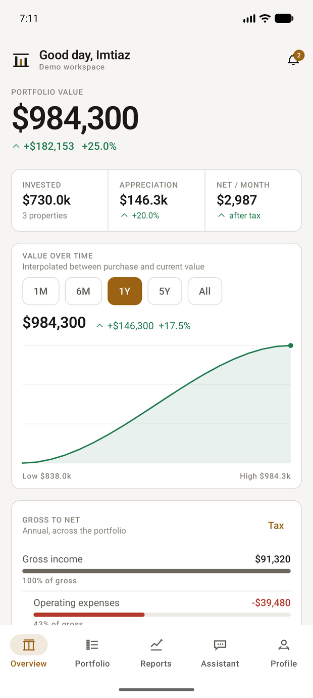 |

### Tablet and desktop-style layouts

Navigation is structural: a bottom bar on a phone, a rail from 600dp, and a
wider working area with three-column metrics from 840dp.

<div align="center">
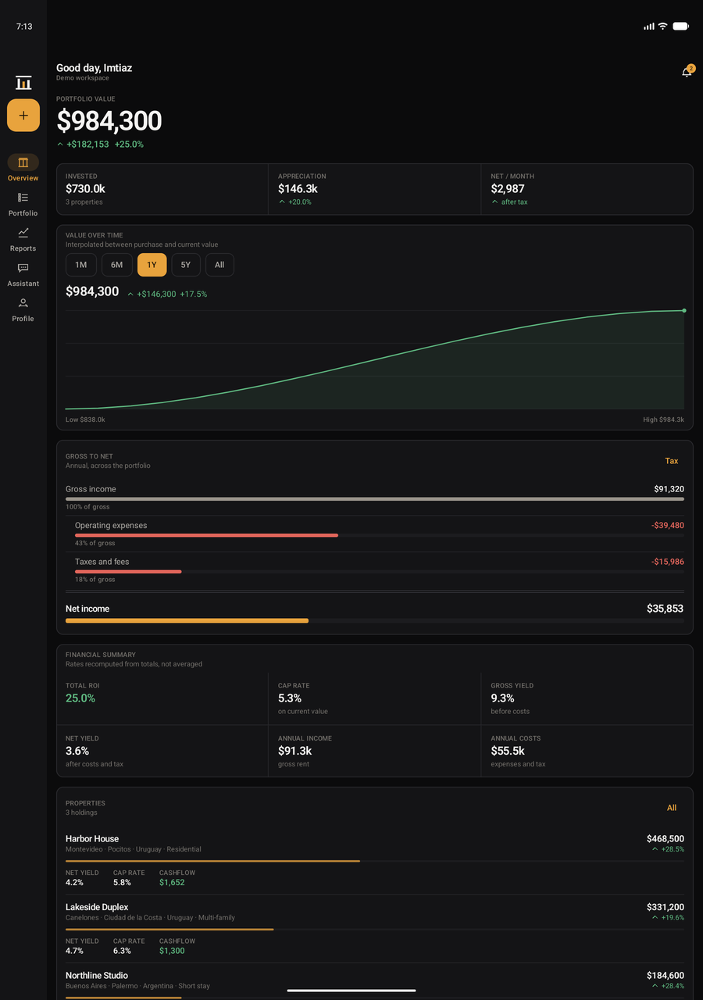
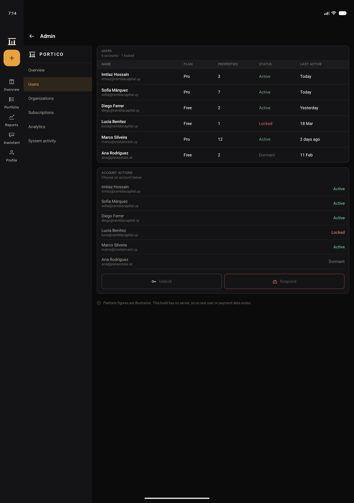
</div>

The admin platform gets a desk layout, with its own section rail and real
multi-column tables, and it is reachable on a phone too, so it is demonstrable
on any device.

---

## What's in it

**Portfolio.** Register with search, filter and sort; property detail across
overview, income, expenses, documents and tax; a six-step capture flow with
live analysis at step five; edit and delete.

**Analysis.** ROI, capital ROI, cash-on-cash, cap rate, gross and net yield,
monthly and annual cashflow. Reports for performance, cashflow, allocation,
property comparison and gross-vs-net.

**Tax.** A jurisdiction engine covering **Bangladesh** (Dhaka North, Dhaka
South, Chattogram), **Uruguay** (Montevideo, Canelones, Maldonado) and
**Argentina** (CABA, Buenos Aires, Córdoba). Nine jurisdictions, every rate an
editable assumption with its reasoning attached.

**Multi-currency.** Each property records the currency its figures were
entered in, and everything converts before it is summed.

**Documents.** Private library with a real system file picker, category
filing, a viewer, and states for uploading, failed, unavailable and restricted.

**Assistant.** On-device analysis with the working shown. Handles extremes,
comparisons, tax share, allocation, and what-if scenarios on rent or costs.

**Valuation and acquisition.** Comparable-based estimates against purchase
price and recorded value; a search-to-decision flow that runs the same engine on
a property you don't own yet.

**Subscription.** Sandbox checkout, receipts, billing history, cancel and
resume.

**Account.** Preferences, currency, exchange rates, jurisdiction, appearance,
reduce-motion, notifications, security with live session management, privacy,
workspace with roles and permissions, and a six-section admin platform.

**Import and export.** The register round-trips as CSV. Export writes a
portfolio summary and a full income/expense ledger to the share sheet; import
reads the same shape back, skipping duplicates and reporting rejected rows by
line number.

---

## Currency

A portfolio spanning Dhaka, Montevideo and Buenos Aires holds three currencies,
and adding those figures together without converting produces a number that
means nothing.

Each property carries its own currency. Conversion happens **once**, at the
boundary of `Finance.analyse`, so everything downstream works in a single
currency without knowing conversion exists.

Rates are expressed as units per 1 USD and are **your assumptions, not a feed**,
the same philosophy as the tax rates. A stale rate you set and can see beats a
plausible-looking one you cannot check.

> The property worth knowing: **switching display currency moves every amount
> and leaves every rate untouched.** ROI, cap rate and net yield are ratios, so
> they come out identical in taka or dollars. There is a test asserting exactly
> that.

---

## Sandbox payments

Checkout is a working flow, not a mock screen: Luhn validation, expiry and CVC
checks, a processing state, distinct decline paths, a receipt, persisted billing
history, and cancel-at-period-end with resume.

**No money moves and no payment provider is contacted.** Outcomes are driven by
the published, non-functional test card numbers, tappable in the app:

| Card | Outcome |
| --- | --- |
| `4242 4242 4242 4242` | Succeeds |
| `4000 0000 0000 0002` | Card declined |
| `4000 0000 0000 9995` | Insufficient funds |
| `4000 0000 0000 0069` | Expired card |
| `4000 0000 0000 0119` | Processing error |

Any future expiry and any 3-digit code work. Only the card brand and last four
digits are ever persisted, never the full number, and there is a test asserting
it. Pro is priced at $12.00/month as **sandbox pricing**, labelled as such in
the UI. Swapping in a real processor means replacing `SandboxProcessor.authorise`
and nothing else.

---

## Signing in

Three ways in:

- **Email and password** via Clerk. The workspace policy requires a
  **15-character minimum**. The app states this before you type, with a live
  character counter, and validates against it.
- **Google or GitHub**, both enabled on the Clerk instance.
- **Demo data.** A sample portfolio, no account, works fully offline.

The Clerk publishable key lives in `gradle.properties`. Without it the app
offers the demo path rather than a dead end.

Clerk's development instance also accepts test addresses of the form
`you+clerk_test@example.com` with verification code `424242`, which is the most
reliable way to demonstrate sign-up without a real inbox.

---

## Running it

Open the folder in Android Studio and run the `app` configuration.

From a shell, with Android Studio's bundled JDK:

```bash
JAVA_HOME="/c/Program Files/Android/Android Studio/jbr" ANDROID_HOME="$HOME/AppData/Local/Android/Sdk" gradle :app:assembleDebug
```

The APK lands at `app/build/outputs/apk/debug/app-debug.apk`.

---

## Tests

```bash
JAVA_HOME="/c/Program Files/Android/Android Studio/jbr" gradle :app:testDebugUnitTest
```

42 JVM tests cover the four things most worth locking down:

| Suite | Covers |
| --- | --- |
| `FinanceTest` | The gross-to-net chain reconciling, cap rate excluding tax where net yield does not, negative cashflow surviving unclamped, recorded tax replacing the jurisdiction assumption rather than stacking, portfolio rates recomputed from totals rather than averaged |
| `ExchangeTest` | Round trips, cross-currency routing through the base, mixed-currency aggregation, and the invariance property above |
| `SandboxPaymentTest` | Mod-10 validation, expiry and CVC rules, every decline branch, and that the full card number never reaches a persisted record |
| `PorticoImportTest` | Quoted commas, header-order independence, duplicate skipping, and rejected rows reported with their line number |

---

## Architecture

```
domain/     Models, Finance, Tax, Exchange, Payments, Analyst, Seed
            pure Kotlin, no Android dependencies, fully unit-tested
data/       PorticoStore: single owner of state, persists to DataStore
            PorticoExport / PorticoImport: CSV round-trip
ui/theme/   Colour roles, semantic extensions, tabular-figure type scale
ui/design/  Panels, rows, charts, icons, logo, the seven state patterns
ui/screens/ One file per product area
```

Entities follow the schema delivered in Milestone 1: user, portfolio,
financial, document, subscription, enterprise, AI, external data, tax and system
domains.

---

## What is real and what is illustrative

**Real.** Every return, yield, cap rate, cashflow and tax figure is computed by
`domain/Finance.kt` and `domain/Tax.kt` from records in your workspace.
Everything persists across restart via DataStore. Clerk authentication, document
picking, CSV import and export, and session revocation all hit real systems.

**Illustrative, and labelled as such in the app.** The three seeded properties,
comparable properties, market signals, acquisition listings, organisation
members, audit entries and admin platform metrics. Every tax rate and every
exchange rate is an assumption you can edit.

**Not connected.** Any backend. Firebase, cloud document storage, real payment
processing, push delivery and external property data are integration seams, not
shipped services. Records never leave the device.

---

## Language

The app ships in English only.

There was a language selector offering Spanish and Portuguese; it changed a
preference and nothing else, which is precisely the kind of control that only
reports rather than does. It has been removed rather than left as decoration.

Doing it properly means 628 distinct strings (421 labels, 207 sentences)
extracted and translated, and financial terminology is not somewhere to guess.
The seam is clean if you want it: strings are inline in the composables, so
extraction to `strings.xml` plus a `values-bn` or `values-es` set is mechanical.

---

## Design record

- Durable product truth: [PRODUCT.md](PRODUCT.md)
- Implemented visual system: [DESIGN.md](DESIGN.md)
- Direction contract: the header comment in `ui/PorticoApp.kt`
- Milestone 1 wireframes and schema: `diagrams/`
