<p align="center">
  
</p>

<h1 align="center">Portico</h1>

<p align="center">
  <strong>Real-estate portfolio intelligence for Android.</strong><br />
  Turn property records into a defensible view of value, yield, cashflow, tax and return.
</p>

<p align="center">
  
  
  
  
  
  <a href="LICENSE"></a>
</p>

<p align="center">
  <a href="#product-story">Product</a> ·
  <a href="#product-tour">Screens</a> ·
  <a href="#capabilities">Capabilities</a> ·
  <a href="#architecture">Architecture</a> ·
  <a href="#getting-started">Get started</a> ·
  <a href="#tests">Tests</a>
</p>

<p align="center"><sub>Designed and built by Imtiaz Hossain · CSE489</sub></p>

---

## Product story

A property portfolio is not one number. It is gross rent falling through
operating costs and tax to whatever actually survives.

Portico makes that subtraction visible on every property and across the whole
register. The app pairs owner-scoped records with a financial engine that
recomputes return, yield, cap rate and cashflow from source transactions rather
than storing impressive-looking percentages.

| Financial truth | Private workspace | Local intelligence | Adaptive interface |
| --- | --- | --- | --- |
| Gross-to-net calculations reconcile to the underlying records. | Clerk sessions and owner-scoped Firestore collections isolate each account. | Portfolio questions are answered on-device by default. Cloud analysis is opt-in and sends computed figures only, never an address or a document. | Phone navigation becomes a rail and wider working surface on tablets. |

<div align="center">


</div>

The gross-to-net waterfall on the right is the product's whole argument, and it
is the same component at four scales: dashboard summary, property detail, tax
module, gross-vs-net report. Each deduction shows a bar proportional to gross
and its share as a percentage, closing under a double rule on the net figure.

**Every figure is computed.** Nothing stores a return, a yield or a cap rate;
`domain/Finance.kt` derives them from the records in your workspace. A property
you add is analysed by exactly the same rules as the seeded ones.

---

## Product tour

Every screenshot below is the release build running on a device, not a mockup.

### Register and property

| Portfolio register | Property detail |
| --- | --- |
|  |  |
| Search, filter by country, region, type and performance, and sort, all operating on computed financials, so *sort by net yield* ranks by the same number the property page shows. | Value over time with a scrub interaction, then return and yield, the monthly chain, acquisition facts, income, expenses, documents and tax. |

### Analysis

| Allocation reports | Assistant, with the working shown |
| --- | --- |
| 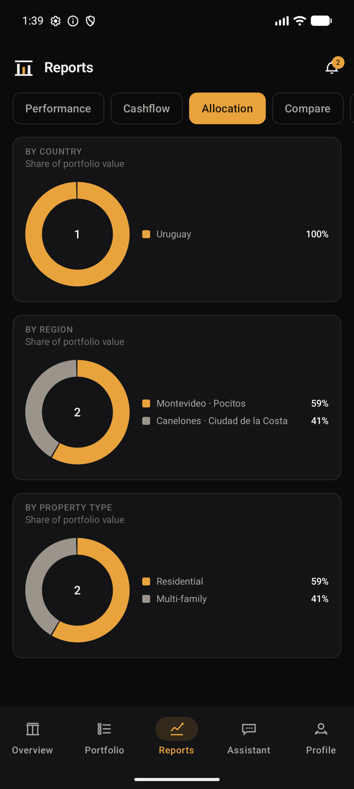 |  |
| Five reports: performance, cashflow, allocation, property comparison and gross-vs-net. Allocation converts currencies before comparing shares. | Every answer carries the arithmetic that produced it, so a figure can be checked rather than trusted. |

### Tax and payments

| Bangladesh tax rules | Gateway checkout |
| --- | --- |
| 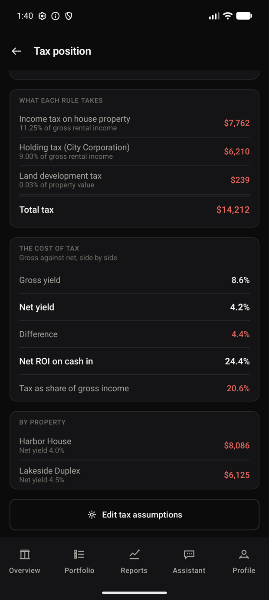 | 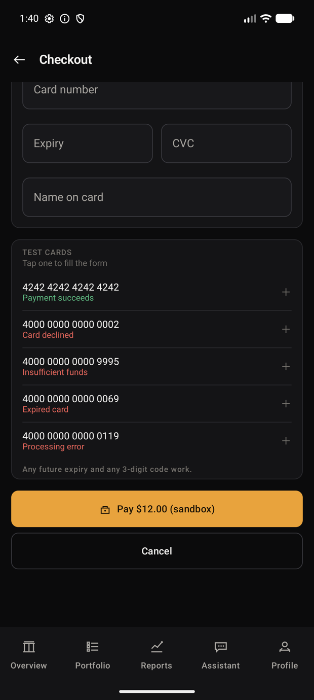 |
| Every rate is an editable assumption carrying its own working. `0.75 x 12% = 9% of gross rent` makes the 25% maintenance allowance auditable. | Two routes, both sandboxes. The built-in one validates cards and walks every decline path without contacting a provider. The SSLCommerz route hands off to the real gateway and settles a real sandbox transaction. |

### Bangla

Portico ships in English and Bangla: 770 translated strings covering the
interface a member actually works in.

| Dashboard | Gross to net |
| --- | --- |
| 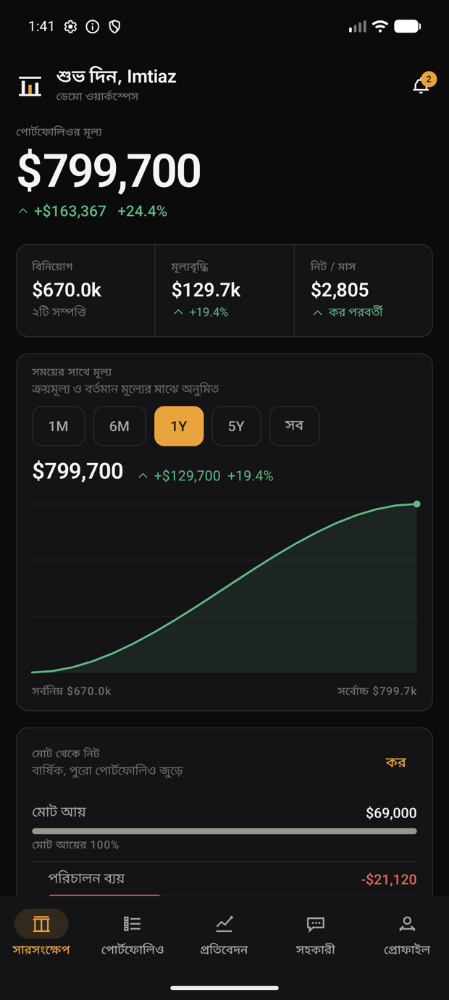 | 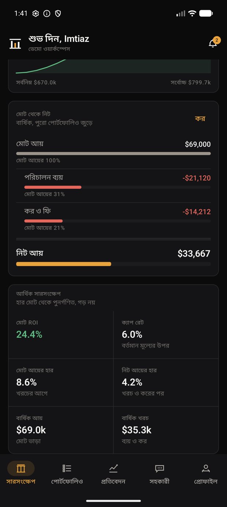 |

### Entry and theme

| Onboarding | Light theme |
| --- | --- |
|  | 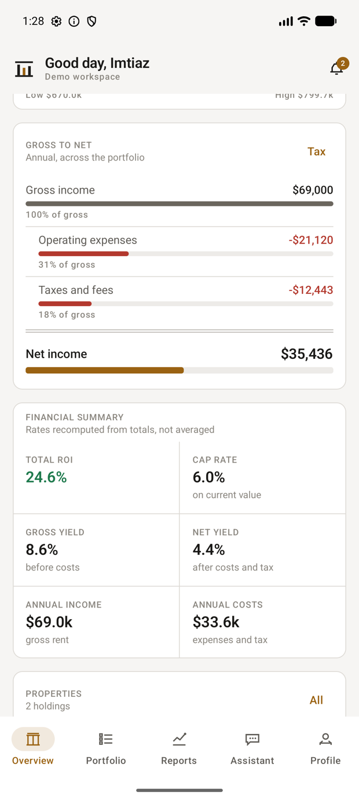 |

### Tablet and desktop-style layouts

Navigation is structural: a bottom bar on a phone, a rail from 600dp, and a
wider working area with three-column metrics from 840dp.

<div align="center">
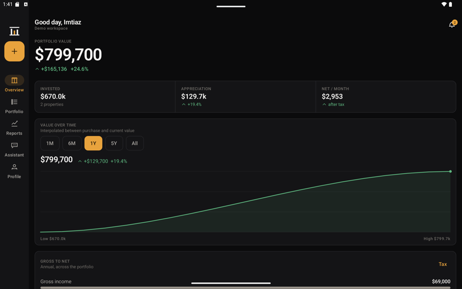
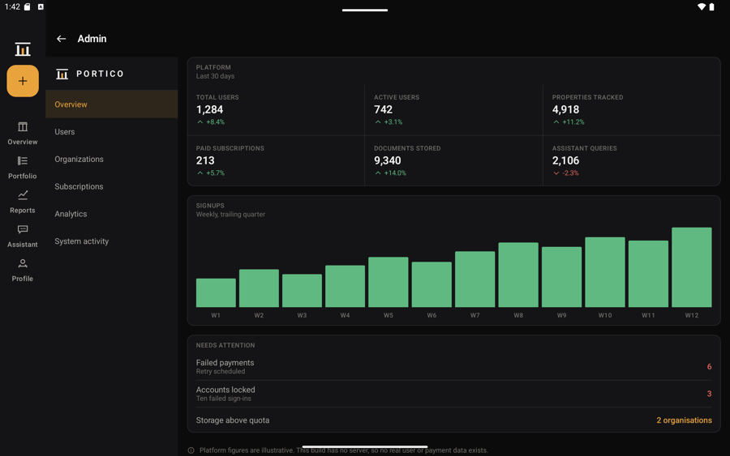
</div>

The platform console gets a desk layout, with its own section rail and real
multi-column tables, and it is reachable on a phone too, so it is demonstrable
on any device. The figures above are counted across every tenant by the server,
and each section states whether it is reading the platform or your own
workspace.

<div align="center">
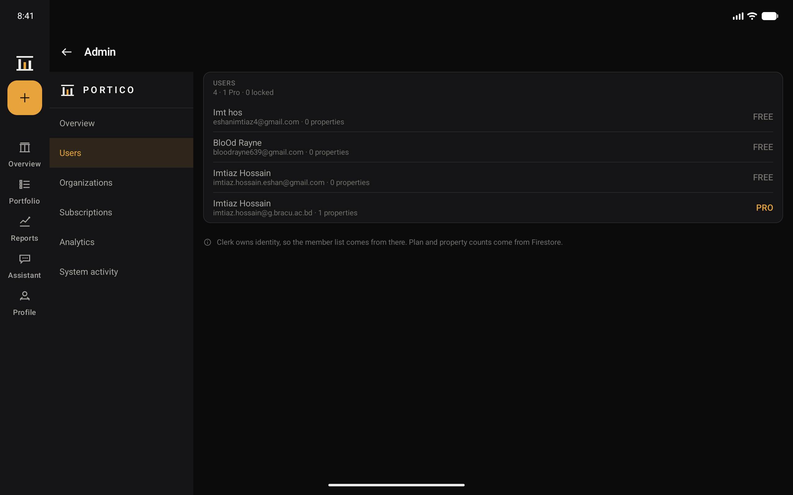
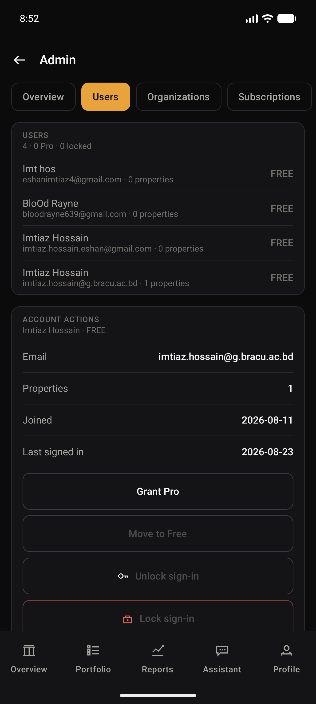
</div>

---

## Capabilities

| Area | What works end to end |
| --- | --- |
| **Portfolio** | Search, filter and sort; property detail; six-step capture with live analysis; photographs; edit and delete; server-enforced Free-plan limit. |
| **Financial analysis** | ROI, capital ROI, cash-on-cash, cap rate, gross/net yield, monthly/annual cashflow, value history and gross-to-net waterfall. |
| **Reports** | Performance, cashflow, allocation, property comparison and gross-versus-net analysis with cross-currency normalization. |
| **Tax** | Editable assumptions for nine jurisdictions across Bangladesh, Uruguay and Argentina, with the arithmetic attached to every rate. |
| **Documents** | Private library, Android system picker, upload/download/delete, categories, an in-app PDF reader and recovery states. |
| **Portico Intelligence** | On-device portfolio analysis, comparisons and what-if scenarios with the working shown. Cloud analysis via Gemma is opt-in and sends computed figures only. |
| **Valuation and acquisition** | Comparable-based estimates and a search-to-decision flow using the same finance engine as owned properties. |
| **Plans and payments** | Free/Pro rules, receipts, billing history, cancellation and resume. Checkout runs either the built-in sandbox or SSLCommerz's hosted gateway, chosen by the server. No card is charged on either. |
| **Account and workspace** | Clerk email/OAuth authentication, in-app password change, live session management, account deletion, organisations with server-enforced roles, and admin surfaces. |
| **Portability** | CSV export/import with duplicate detection and line-level rejection reporting. |
| **Languages** | English and Bangla across 770 interface strings, switchable in-app and from Android's per-app language settings. Assistant prose and backend messages remain English. |

---

## Currency

A portfolio spanning Dhaka, Montevideo and Buenos Aires holds three currencies,
and adding those figures together without converting produces a number that
means nothing.

Each property carries its own currency. Conversion happens **once**, at the
boundary of `Finance.analyse`, so everything downstream works in a single
currency without knowing conversion exists.

Rates are expressed as units per 1 USD and are **your assumptions, not a feed**,
the same philosophy as the tax rates. A stale rate you set and can see beats a
plausible-looking one you cannot check.

> The property worth knowing: **switching display currency moves every amount
> and leaves every rate untouched.** ROI, cap rate and net yield are ratios, so
> they come out identical in taka or dollars. There is a test asserting exactly
> that.

---

## Sandbox payments

Portico ships two checkout routes and the server decides which is live. The app
asks rather than assumes, so an unconfigured build never offers a payment route
it cannot complete, and both the plan card and the checkout screen quote the
currency that route actually charges.

### Built-in sandbox

The default. A working server-verified flow: Luhn validation, expiry and CVC
checks, a processing state, distinct decline paths, a receipt, persisted billing
history, and cancel-at-period-end with resume. The authenticated bridge, not the
Android client, writes subscription and payment state.

**No money moves and no payment provider is contacted.** Outcomes are driven by
the published, non-functional test card numbers, tappable in the app:

| Card | Outcome |
| --- | --- |
| `4242 4242 4242 4242` | Succeeds |
| `4000 0000 0000 0002` | Card declined |
| `4000 0000 0000 9995` | Insufficient funds |
| `4000 0000 0000 0069` | Expired card |
| `4000 0000 0000 0119` | Processing error |

Any future expiry and any 3-digit code work. A typed number is matched locally
to one of these published test outcomes; only a non-sensitive outcome token is
sent to the bridge. A full number is never transmitted or persisted. In this
mode Pro is priced at $12.00/month as **sandbox pricing**, labelled as such in
the UI. Production billing replaces that outcome token with a verified Play
Billing or processor purchase token.

### SSLCommerz gateway

Switched on with `PORTICO_BILLING_MODE=sslcommerz` and store credentials. The
bridge opens a session, the member pays on SSLCommerz's own page in a Custom
Tab, and the plan activates once SSLCommerz confirms the payment. Pricing is
stated in taka, because SSLCommerz settles in BDT and converting at request time
would leave the amount charged different from the amount shown.

<div align="center">

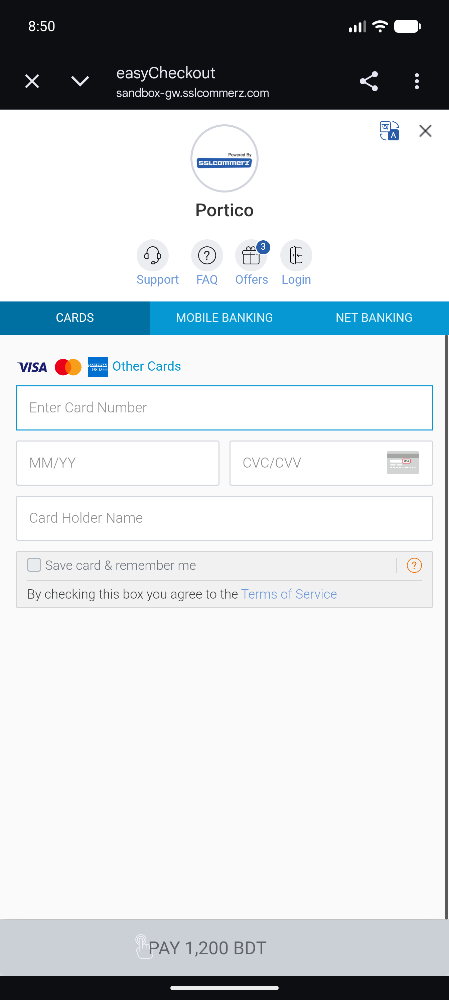
</div>

How settlement is verified, and why the app asks as well as waits, is described
under [What is real and what is illustrative](#what-is-real-and-what-is-illustrative).

---

## Signing in

Three ways in:

- **Email and password** via Clerk. The workspace policy requires a
  **15-character minimum**. The app states this before you type, with a live
  character counter, and validates against it.
- **Google or GitHub**, both enabled on the Clerk instance.
- **Demo data.** A sample portfolio, no account, works fully offline.

The Clerk publishable key lives in `keys.properties`, which is ignored by Git.
Copy `keys.properties.example` over it and fill in your own. Without the key the
app offers the demo path rather than a dead end.

Clerk's development instance also accepts test addresses of the form
`you+clerk_test@example.com` with verification code `424242`, which is the most
reliable way to demonstrate sign-up without a real inbox.

---

## Getting started

### Requirements

- Android Studio with Android SDK 36
- JDK 17 or Android Studio's bundled runtime
- Android 8.0/API 26 or newer device or emulator

### Build

```powershell
git clone https://github.com/ImtiazHossain-Eshan/Portico_Android.git
cd Portico_Android
$env:JAVA_HOME = "C:\Program Files\Android\Android Studio\jbr"
.\gradlew.bat :app:assembleDebug
```

The APK is written to `app/build/outputs/apk/debug/app-debug.apk`. You can also
open the repository in Android Studio and run the `app` configuration.

The complete demo cockpit works without an account. Authenticated cloud flows
need a `keys.properties` in the repository root. Copy the tracked example and
fill in your own values:

```powershell
copy keys.properties.example keys.properties
```

```properties
CLERK_PUBLISHABLE_KEY=pk_test_or_pk_live_...
FIREBASE_TOKEN_BRIDGE_URL=https://your-bridge.vercel.app/api/firebase-token
PORTICO_FILE_API_URL=https://your-bridge.vercel.app/api/files
```

`keys.properties` is ignored by Git so that no key reaches the repository. Each
name also falls back to a Gradle property and then an environment variable, which
is how CI supplies them without a file on disk.

`app/google-services.json` enables Firebase Android services when present. It is
intentionally ignored by Git: after cloning, download the Android configuration
from **Firebase Console → Project settings → Your apps → Portico**, then place it
at that path. Never put a Firebase service-account JSON or private backend key
inside the APK or repository.

### Bridge environment

The serverless bridge holds every secret the app is not allowed to carry. Copy
`bridge/.env.example` to `bridge/.env.local` for local work, and set the same
names as Vercel project environment variables for a deployment.

| Variable | Purpose |
|---|---|
| `CLERK_ISSUER` | Issuer the bridge validates session JWTs against. |
| `FIREBASE_PROJECT_ID`, `FIREBASE_CLIENT_EMAIL`, `FIREBASE_PRIVATE_KEY` | Service-account credentials for Firestore. Never shipped to Android. |
| `CLERK_SECRET_KEY` | Required for account deletion and for the admin member list. |
| `GEMMA_API_KEY`, `GEMMA_MODEL` | Cloud analysis. Absent, the endpoint reports `not_configured` and the app uses its on-device analyst. |
| `PORTICO_BILLING_MODE` | `sandbox` for the built-in fake-card flow, `sslcommerz` to route checkout through the gateway. |
| `SSLCZ_STORE_ID`, `SSLCZ_STORE_PASSWD`, `SSLCZ_SANDBOX` | Gateway store credentials. Anything other than an explicit `false` stays on the sandbox host. |
| `PORTICO_PUBLIC_URL` | Absolute origin of the deployment. SSLCommerz calls back to it, so it cannot be relative; falls back to `VERCEL_URL`. |
| `PORTICO_ADMIN_USER_IDS` | Comma-separated Clerk user ids allowed to read across every tenant and change plans or lock sign-in. Empty disables the admin surface entirely. |

`BLOB_READ_WRITE_TOKEN` is injected by Vercel when a Blob store is linked to the
project, so it is not listed in the example file.

---

## Tests

```bash
./gradlew :app:testDebugUnitTest
```

```bash
./gradlew :app:connectedDebugAndroidTest
```

**116 tests: 109 on the JVM and 7 on a device.** The unit suites cover the domain
layer, which is pure Kotlin with no Android dependency and therefore testable
without an emulator.

| Suite | Tests | Covers |
| --- | --- | --- |
| `TaxTest` | 22 | Every jurisdiction's arithmetic against figures worked out by hand, that each rule's published working matches the rate it charges, capital gains staying out of the annual chain, and overrides clamping to a sane range |
| `AccessControlTest` | 16 | The role ladder, that a senior role never holds less than a junior one, that an unreadable role degrades to least privilege, and that a tampered plan tier can never read as paid |
| `SandboxPaymentTest` | 14 | Mod-10 validation, expiry and CVC rules, every decline branch, and that a full card number never reaches a persisted record |
| `ExchangeTest` | 13 | Round trips, cross-currency routing through the base, mixed-currency aggregation, and rate invariance across display currencies |
| `AnalystTest` | 11 | That an answer names the property its own arithmetic points at, that a question outside the records is refused rather than guessed, and that every answer carries its working |
| `FinanceTest` | 8 | The gross-to-net chain reconciling, cap rate excluding tax where net yield does not, negative cashflow surviving unclamped, and portfolio rates recomputed from totals rather than averaged |
| `AssistantPrivacyTest` | 7 | That the fact sheet sent to a cloud model can never contain a street address, a private note or a record id |
| `GatewayCheckoutTest` | 11 | That a gateway redirect with an unknown result reads as failure rather than success, that a foreign scheme is refused, that an unrecognised payment status degrades to failed, and that every paid plan carries a taka price inside SSLCommerz's accepted band |
| `PorticoImportTest` | 7 | Quoted commas, header-order independence, duplicate skipping, and rejected rows reported with their line number |
| `PorticoJourneyTest` | 7 | On a device: launch, demo entry, every primary destination, the register, property detail, the waterfall reaching the screen, and the assistant answering |

`AssistantPrivacyTest` is the one worth reading. The privacy screen promises that
addresses and documents never leave the device, and that file is what keeps the
promise true a year from now, when someone adds a field to `Property` and
reaches for the obvious `appendLine(property)`.

---

## Architecture

```
domain/     Models, Finance, Tax, Exchange, Payments, Analyst, Seed
            pure Kotlin, no Android dependencies, fully unit-tested
data/       PorticoStore: single owner of state, offline cache + cloud sync
            FirestoreWorkspaceRepository: normalized owner-scoped records
            PorticoBackend: authenticated quota, billing and push APIs
            PorticoFiles: authenticated private document transfer
            PorticoExport / PorticoImport: CSV round-trip
ui/theme/   Colour roles, semantic extensions, tabular-figure type scale
ui/design/  Panels, rows, charts, icons, logo, the seven state patterns
ui/screens/ One file per product area
```

Entities follow the schema delivered in Milestone 1: user, portfolio,
financial, document, subscription, enterprise, AI, external data, tax and system
domains.

---

## What is real and what is illustrative

**Real.** Every return, yield, cap rate, cashflow and tax figure is computed by
`domain/Finance.kt` and `domain/Tax.kt` from records in your workspace.
Everything persists across restart through an account-scoped DataStore cache and
normalized Firestore collections. Clerk authentication, realtime cloud sync,
private document upload/download/delete, server-enforced property quotas,
server-owned sandbox subscriptions, FCM Installation-ID registration and delivery, CSV
import/export, and session revocation all hit real systems. Existing schema-v1
workspace snapshots migrate to the normalized schema on authenticated sync.

Organisations, membership and roles are real: created through the bridge,
stored in Firestore, and enforced server-side. Nobody can grant a role at or
above their own, and the last owner cannot be removed. Account deletion is real
and complete: records, private files, the Firebase identity and the Clerk
identity all go, behind a typed confirmation the server re-checks. The audit
trail is derived from activity actually recorded in the workspace.

**Illustrative, and labelled as such in the app.** The seeded properties,
comparable properties, market signals, acquisition listings, and the security
events on the admin activity page. Every tax rate and every exchange rate is an
assumption you can edit.

**Platform administration is real, and gated outside the app.** The console's
Overview and Users sections read across every tenant: counts come from Firestore
collection-group aggregates, the member list from Clerk, and plan and property
figures per member from Firestore. An administrator can move a member between
Free and Pro and can ban or unban sign-in, which Clerk applies. Admin is granted
by the `PORTICO_ADMIN_USER_IDS` deployment variable and nothing else. It cannot
be requested through an endpoint, set from inside the app, or written to
Firestore by any client, because a privilege the governed thing can grant itself
is not a privilege. Deleting another member's account is deliberately absent:
banning is reversible and leaves their records intact, which is why it is the
strongest action offered. The Subscriptions and Analytics sections still read
your own workspace, and each section states which of the two it is.

Market reference data is served by a provider record rather than baked into the
app: `/api/market` reads Firestore's `public` tree, and every response states
whether its figures were observed or modelled. Today it reports `modelled`,
because claiming otherwise would be the dishonest half of the feature. Pointing
it at a real portal is a change of one collection, not a change of shape.

**Real, against SSLCommerz's sandbox.** Gateway checkout runs end to end:
the bridge opens a session (`/api/payment?mode=init`), the member pays on
SSLCommerz's own page in a Custom Tab, and the plan activates once SSLCommerz
confirms the payment. Verified with a live bKash sandbox transaction, which
settled in about ten seconds: order `PENDING` to `VALID`, gateway status
`VALIDATED`, BDT 1200 matched against the order, Pro active.

**Settlement is asked for as well as waited for.** SSLCommerz reports a payment
two ways, and only one of them is trustworthy on its own. The IPN
(`/api/ipn`) is a server-to-server callback, and the browser redirect
(`?mode=return`) is not evidence of anything, since it can be replayed or typed
by hand. So the redirect carries only a transaction id, and the app then asks
the server to settle (`?mode=confirm`), which queries SSLCommerz directly by
transaction id. Both routes end in the same function, so what may be credited,
and on what evidence, does not depend on which arrived first.

That redundancy is not belt-and-braces. In the sandbox the IPN did not arrive at
all during testing, and the gateway is not ready to answer for a transaction it
has only just redirected from, so the first settle attempt reliably returns
"nothing here yet". Checkout therefore asks repeatedly across a short poll
rather than once.

Every rule their documentation calls out is enforced server-side: the val_id or
transaction id is checked with SSLCommerz rather than trusted from the request,
the amount is compared in whole poisha against the order written before the
member ever reached the gateway, currency must match, and a settled order is a
no-op so a repeated callback cannot credit twice.

Prices are stated in taka rather than converted at request time. SSLCommerz
settles in BDT and converts other currencies at its own rate, which would leave
the amount charged different from the amount shown and make the amount check
impossible to write as an equality.

All of it shares one function dispatching on `?mode=`, plus a thin `/api/ipn`
alias, because Vercel's Hobby plan allows twelve Serverless Functions per
deployment and separate endpoints put the project over.

It stays switched off unless `PORTICO_BILLING_MODE=sslcommerz` and store
credentials are set, and the app asks the server which mode it is in rather than
assuming, so an unconfigured build silently keeps the built-in sandbox instead of
offering a payment route that cannot complete.

**Not connected.** Real money. Both paths are sandboxes: the built-in one
contacts no provider at all, and the gateway one runs against SSLCommerz's
sandbox host with test cards. No card is charged on either.

**Optional.** Cloud analysis. The assistant answers on-device by default, and
that stays the answer of record: its arithmetic is what the working panel shows.
Turning on cloud analysis sends computed figures to Gemma for wording only, and
a test asserts that the payload can never carry a street address, a private note
or a record id. The key lives on the server; no model key ships in the APK.

### Cloud data layout

Every member record is isolated below `users/{clerkUserId}`. Domain entities use
independent collections (`properties`, `income`, `expenses`, `valuations`,
`documents`, `activity`, `notifications`, `conversations`, and `payments`) and
profile/preferences/tax/exchange/subscription records live in `settings`.
Firestore's root user document carries schema version, revision and counts only.
Subscription, receipts, quota counters and FCM installation records are
server-owned; Firestore rules deny Android writes to those paths and deny direct
property creation so the bridge can enforce the Free limit atomically.

Document metadata is stored in Firestore; file bytes are stored in a private
Vercel Blob store. Android never receives Firebase service credentials or a Blob
token. Both APIs verify the current Clerk JWT and derive the owner path on the
server.

---

## Language

Portico ships in **English and Bangla**, with 770 translated strings covering
the interface: navigation, every screen's labels and headings, buttons, form
fields, empty states, dialogs and the settings tree. The screens a member spends
their time in, dashboard, register, property, reports and tax, render entirely
in Bangla.

**What is still English**, stated plainly rather than glossed over: the
assistant's composed answers, the notes attached to each tax rule, payment
decline messages and backend error strings. Those live in `domain/` and `data/`,
which are pure Kotlin with no Android dependency and therefore cannot resolve a
string resource. Translating them means either giving up that separation or
returning keys from the domain for the UI to resolve, which is a design decision
rather than a mechanical one. Roughly 260 strings sit behind it.

Change it in **Profile -> Preferences -> Language**, or from Android's own
per-app language list in system Settings. The app declares a `locales_config`,
so it appears there without any extra work.

Three decisions worth recording.

**Financial figures stay in Latin digits in both languages.** Under a Bangla
locale the platform formatter emits Bengali numerals, which rendered `$12.67M`
as `$১২.৬৭M`: a Latin currency symbol against Bengali digits, in a column meant
to align digit-for-digit. `Money` formats against `Locale.ROOT`, so a taka
figure reads the same either way.

**Financial terms carry the English alongside the Bangla** where the Bangla
alone would be ambiguous: `ক্যাপ রেট (cap rate)`, `নিট আয়ের হার (net yield)`.
That is how these figures are actually discussed by investors here, and it beats
inventing a term nobody uses.

**The assistant's suggested questions display in Bangla but are sent in
English.** The analyst matches English keywords, so translating what it receives
would stop it understanding its own suggestions.

Names stay as written: property names, member names and currency codes are data,
not language.

---

## Design record

- Durable product truth: [PRODUCT.md](PRODUCT.md)
- Implemented visual system: [DESIGN.md](DESIGN.md)
- Direction contract: the header comment in `ui/PorticoApp.kt`
- Milestone 1 wireframes and schema: `diagrams/`
- Final submission report, AI usage declaration and diagrams: `Doc/`

---

## Project and license

Portico was created by **Imtiaz Hossain** (`23101137`) for **CSE489**. The source
is available under the [MIT License](LICENSE).
